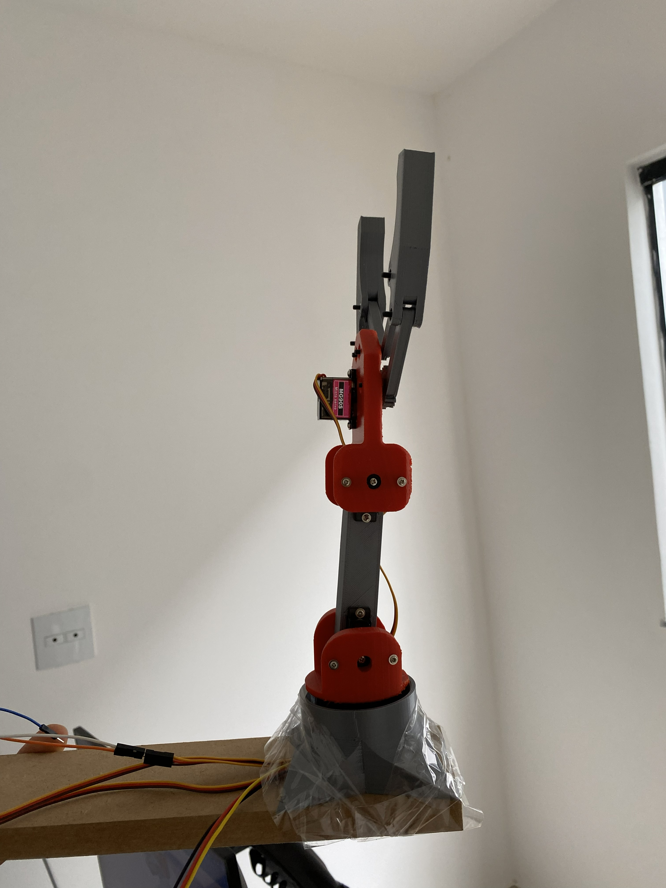

# Aprendendo com impressão 3D - Estudos em Robótica 🤖

[](https://www.espressif.com/en/products/socs/esp32)
[](LICENSE)
[](https://www.youtube.com/@projetospark3d451)

## 📚 Sobre o Projeto

Este repositório documenta o desenvolvimento de um braço robótico e estudo de obótica em geral baseado no conteúdo do curso [Introduction to Robotics](https://ocw.mit.edu/courses/2-12-introduction-to-robotics-fall-2005/) do MIT OpenCourseWare. O projeto está sendo desenvolvido como uma série de vídeos para o YouTube, onde cada versão implementa conceitos progressivamente mais avançados.

### 🎯 Objetivos da Série

- Utilizar a impressão 3D para estudos em robótica
- Aplicar conhecimentos teóricos de robótica em um projeto prático
- Documentar o processo de aprendizagem e desenvolvimento
- Criar conteúdo educacional em português sobre robótica
- Evoluir gradualmente a complexidade do sistema de controle

## 🖼️ Protótipo Inicial



*Primeira versão do braço robótico de 3 DOF (Graus de Liberdade)*

## 📖 Conteúdo por Versão

### 🔹 Versão 1.0 - Capítulo 1: Fundamentos (Atual)

**Status:** ✅ Concluído

**Conceitos Abordados:**
- História da Robótica
- Objetivos da Robótica

**Implementação:**
- **Hardware:** Impressão 3D + ESP32 + 4 Servos MG90S
- **Firmware:** Controle via comandos seriais (ESP-IDF)
- **Software:** Interface gráfica Python (Tkinter)
- **Comunicação:** UART @ 115200 baud

**Características:**
- Controle de 4 servomotores (Base, Ombro, Cotovelo, Garra)
- Modos de movimento: Instantâneo e Suave
- Interface Python para controle via sliders
- Logs de comunicação em tempo real

---

### 🔹 Versão 2.0 - Planejado

**Capítulos do MIT:** A definir
**Funcionalidades Planejadas:**
- TBD

---

## 🛠️ Estrutura do Projeto

```
robotics-study-robotic-arm-lw3DP/
├── main/                      # Firmware ESP32 (C)
│   ├── main.c                 # Código principal do controlador
│   └── CMakeLists.txt
├── python_app/                # Aplicação de controle (Python)
│   ├── robotic_arm_controller.py
│   ├── requirements.txt
│   └── pyproject.toml
├── assets/                    # Imagens e recursos
│   └── robo_prototipo_1.jpg
├── build/                     # Artefatos de compilação
├── CMakeLists.txt             # Configuração CMake ESP-IDF
├── sdkconfig                  # Configuração do ESP32
└── README.md
```

## 🚀 Como Usar

### Pré-requisitos (até o momento)

#### Para o Firmware (ESP32)
- [ESP-IDF v5.2.2](https://docs.espressif.com/projects/esp-idf/en/latest/esp32/get-started/)
- ESP32 DevKit
- 4x Servos MG90S
- Fonte de alimentação adequada (Utilizadas: 2 Baterias 18650 2200mah em série)

#### Para a Aplicação Python
- Python 3.8+
- pip (gerenciador de pacotes Python)

### 📥 Instalação

#### 1. Configurar o Firmware ESP32

```powershell
# Configurar variável de ambiente ESP-IDF
$env:IDF_PATH = 'C:\Users\SEU_USUARIO\esp\v5.2.2\esp-idf'

# Navegar até o diretório do projeto
cd d:\Code\ESP\robotics-study-robotic-arm-lw3DP

# Compilar o projeto
idf.py build

# Fazer flash no ESP32 (substitua COM3 pela sua porta)
idf.py -p COM3 flash
```

#### 2. Instalar Aplicação Python

```powershell
# Navegar até o diretório da aplicação
cd python_app

# Criar ambiente virtual
python -m venv .venv

# Ativar ambiente virtual
.venv\Scripts\Activate.ps1

# Instalar dependências
pip install -r requirements.txt

# Executar aplicação
python robotic_arm_controller.py
```

### 🎮 Uso da Interface

1. Selecione a porta COM do ESP32
2. Clique em "Conectar"
3. Escolha o modo de movimento:
   - **Instant:** Movimento direto para a posição
   - **Smooth:** Movimento suave interpolado
4. Ajuste os sliders para controlar cada servo:
   - **Base:** Rotação da base (0-180°)
   - **Shoulder:** Articulação do ombro (0-180°)
   - **Elbow:** Articulação do cotovelo (0-180°)
   - **Gripper:** Abertura da garra (0-180°)

### 📡 Comandos Seriais

| Comando | Formato | Exemplo | Descrição |
|---------|---------|---------|-----------|
| Instant | `I:base,shoulder,elbow,gripper` | `I:90,90,90,90` | Movimento instantâneo |
| Smooth | `S:base,shoulder,elbow,gripper` | `S:45,120,60,30` | Movimento suave |
| Home | `H` | `H` | Posição inicial |
| Query | `?` | `?` | Consultar posição atual |

## 🔌 Conexões de Hardware

| Servo | GPIO ESP32 | Função |
|-------|------------|--------|
| Servo 1 | GPIO 5 | Base (rotação) |
| Servo 2 | GPIO 18 | Ombro (shoulder) |
| Servo 3 | GPIO 19 | Cotovelo (elbow) |
| Servo 4 | GPIO 21 | Garra (gripper) |

**⚠️ Importante:** Utilize uma fonte de alimentação externa para os servos. Não alimente os 4 servos diretamente pelo ESP32!

## 📚 Recursos Educacionais

- [MIT OCW - Introduction to Robotics](https://ocw.mit.edu/courses/2-12-introduction-to-robotics-fall-2005/)
- [ESP-IDF Documentation](https://docs.espressif.com/projects/esp-idf/en/latest/esp32/)
- [Servo Motor MG90S Datasheet](https://www.towerpro.com.tw/product/mg90s-3/)

## 🤝 Contribuições

Sugestões e melhorias são bem-vindas! Sinta-se à vontade para:
- Abrir issues para reportar bugs
- Propor melhorias no código
- Compartilhar ideias para as próximas versões

## 📝 Licença

Este projeto está sob a licença MIT. Veja o arquivo `LICENSE` para mais detalhes.

## 👨‍💻 Autor

**Vinicius Alves** - Projeto Spark
- YouTube: [Projeto Spark](https://www.youtube.com/@projetospark3d451)
- GitHub: [@Vini-Spark](https://github.com/Vini-Spark)

---

## 📊 Histórico de Versões

| Versão | Data | Capítulo MIT | Status | Principais Features |
|--------|------|--------------|--------|---------------------|
| 1.0 | Dez/2025 | Capítulo 1 | ✅ Concluído | Controle básico de servos, Interface Python, Comunicação UART |
| 2.0 | TBD | TBD | 🔄 Planejado | A definir |

---

*Desenvolvido com 💙 para a comunidade de impressão 3D e robótica*
